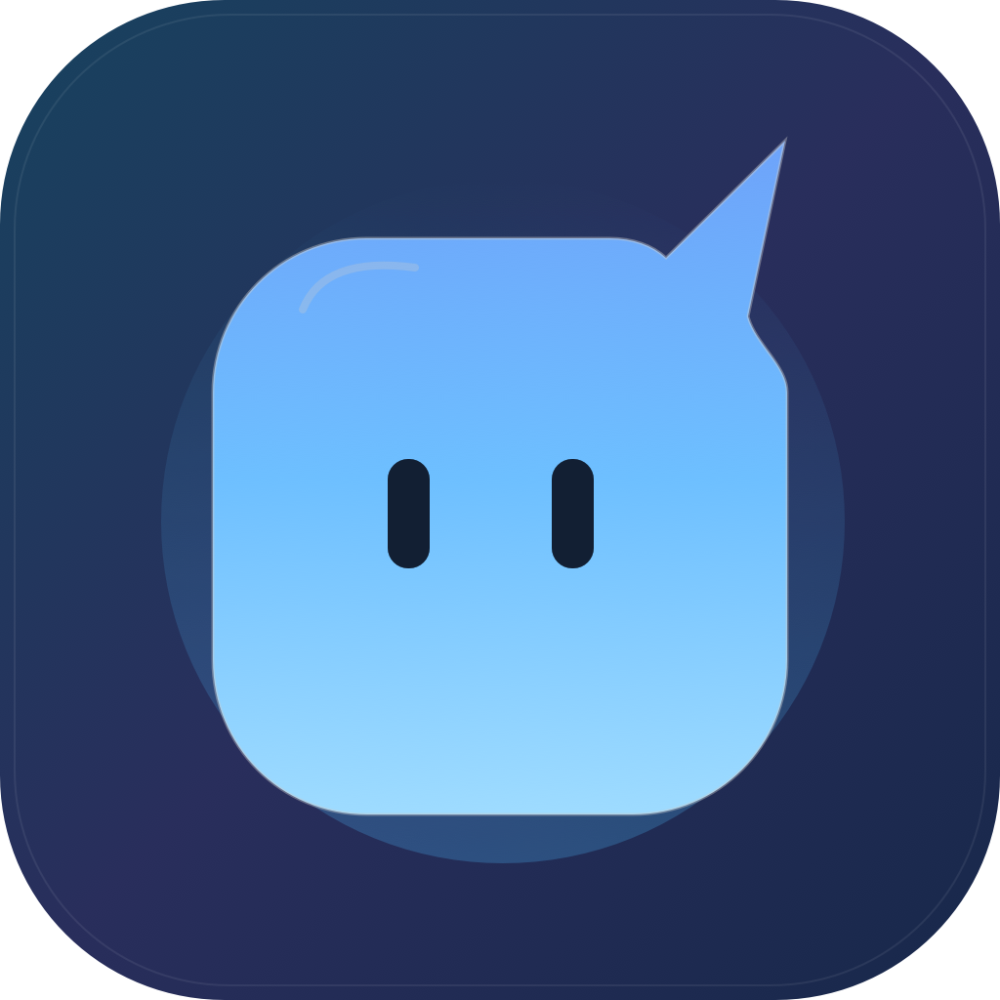

<p align="center">
  
</p>

<h1 align="center">Nudge</h1>

<p align="center">
  A little companion for your Mac. A gentle nudge when Codex needs you.
</p>

<p align="center">
  
  
  
</p>

<p align="center">
  <a href="https://github.com/caynine9/Nudge/releases">Downloads</a> ·
  <a href="#getting-started">Getting started</a> ·
  <a href="#build-from-source">Build from source</a> ·
  <a href="https://github.com/caynine9/Nudge/issues">Report an issue</a>
</p>

Nudge brings Codex activity to your Mac's notch. Switch to another app while Codex works, keep an eye on progress, and come back when something needs your attention. Meet **Nudgie**, the little blue mascot keeping you company.

- **Progress at a glance.** See the project, work status, and current tool activity.
- **A heads-up when it matters.** Notice questions, permission requests, completion, and interruptions.
- **More detail on hover.** Browse detected sessions, then move away to collapse the view.
- **Made for macOS.** Native menu-bar app, Reduce Motion support, and a compact fallback for displays without a notch.
- **Local by default.** No Nudge account, no added telemetry, and no full transcript storage by default. Codex keeps working when Nudge is closed.

> Nudge is in development. Integration targets Codex Desktop and CLI; live verification for both is still pending. Precise thread navigation and permission actions are experimental.

## Install

Requires **macOS 15 or later** and Codex Desktop or CLI to monitor activity.

1. Download `Nudge-<version>-macOS.dmg` from [Releases](https://github.com/caynine9/Nudge/releases), if a build is available.
2. Open the DMG and drag **Nudge.app** into **Applications**.
3. Launch Nudge. Look for it in the menu bar; it doesn't appear in the Dock.

Current personal builds use an ad-hoc signature and aren't notarized, so macOS may require an extra confirmation. See the [distribution guide](docs/Distribution.md) for details.

## Getting started

Nudge uses local **hooks**: small event handlers that tell it when Codex activity changes.

1. Open **Codex hooks** in Nudge's menu and choose **Host configuration**: Desktop or CLI.
2. Check the configuration path. For a custom folder or `CODEX_HOME`, use **Choose configuration folder…**. Desktop and CLI may use different locations.
3. Select **Install or refresh hooks** and confirm the installation.
4. Review and trust Nudge's hooks in Codex as required by your host. Turn off **Demo playground** if enabled, then start or resume a local thread.

The installer backs up existing files before changing them and preserves other hooks. To disconnect Nudge, choose **Remove Nudge hooks from selected config** before deleting the app.

## Build from source

You'll need full Xcode with a Swift 6 toolchain. From the repository root:

```bash
./scripts/package-dmg.sh
```

The universal Apple silicon / Intel build is packaged into `dist/Nudge-<version>-macOS.dmg`.

For development, open `Nudge.xcodeproj`, select the **Nudge** scheme, and Run. Nudge uses SwiftUI for its interface, AppKit for the notch panel, and a native `NudgeBridge` helper with a local Unix socket for activity events.

See the [project brief](docs/Nudge-Project-Brief.md) for product scope and architecture, or the [distribution guide](docs/Distribution.md) for packaging details.
